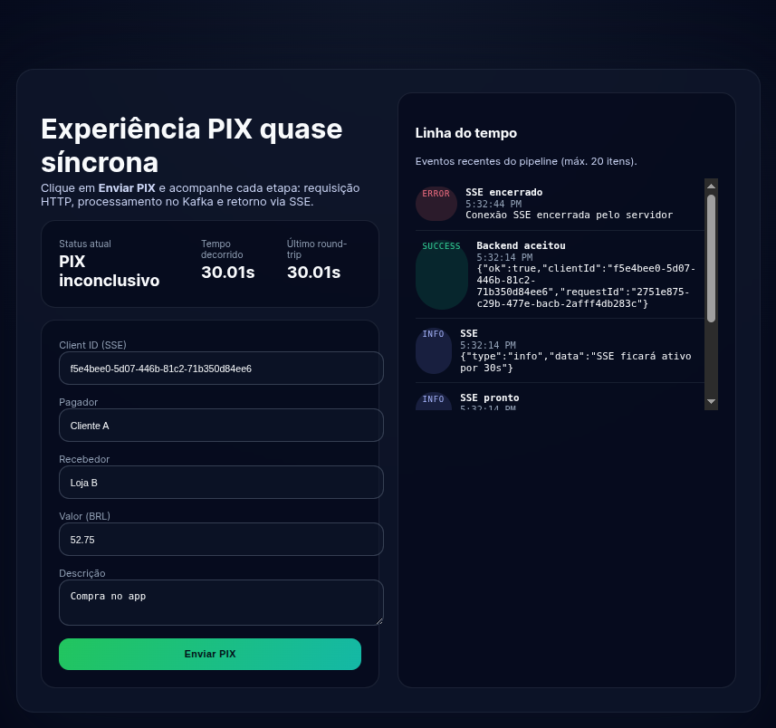
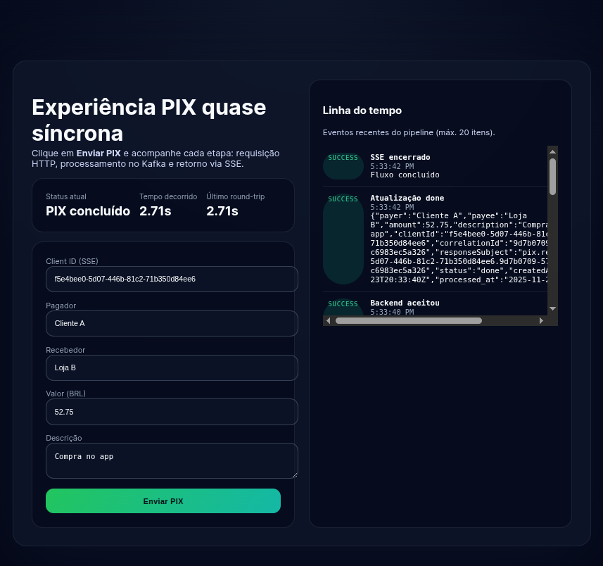

PoC de um fluxo PIX em que o cliente tem sensação síncrona, mas todo o back-end é event-driven (Kafka). A ponte síncrona é feita com SSE + NATS JetStream.




## Arquitetura
- **Front web (React POC)**: formulário para enviar um PIX e escutar eventos via SSE. No Compose há um Nginx que serve os arquivos estáticos e faz proxy de `/pix` e `/events` para o gateway Deno.
- **Gateway Deno**: expõe `/pix` (HTTP) e `/events` (SSE). `/pix` valida e encaminha para o backend Ruby; `/events` mantém a conexão SSE e publica os eventos recebidos do JetStream (`pix.responses.>`). A chave `>` é necessária para escutar 2 chaves diferentes, já que o backend publica respostas com `pix.responses.{clientId}.{correlationId}`
- **Backend Ruby (Sinatra + Karafka)**:
  - `POST /pix` (Sinatra) monta os metadados (`clientId`, `correlationId`, `responseSubject`) e publica no Kafka (`pix_requests`).
  - `PixRequestConsumer`: consome `pix_requests`, simula o processamento e publica em `pix_responses`.
  - `PixResponseBridgeConsumer`: consome `pix_responses` e publica no JetStream (`responseSubject`).
- **NATS JetStream**: usado para distribuir rapidamente as respostas para o gateway Deno.

```
React -> Deno (/pix) -> Backend Ruby (/pix) -> Kafka pix_requests
Kafka pix_responses -> JetStream pix.responses.> -> Deno SSE -> React
```

## Subir infraestrutura
Requer Docker e Docker Compose.

```bash
docker compose up -d
```

Sobe: Kafka + Zookeeper, NATS JetStream, backend (API HTTP + Karafka - serviços `backend-api` e `backend-consumer`), gateway Deno (HTTP + SSE) e Web/Nginx servindo o front.

## Gateway Deno (HTTP + SSE)
```bash
cd deno-sse
deno task dev
# porta padrão: 8000 (config PORT) / NATS_URL se precisar customizar
# use BACKEND_URL para apontar para a API Ruby quando rodar fora do Docker
```

## Backend Ruby (API + Karafka)
Instale gems:

```bash
cd backend
bundle install
```

Terminais separados:
```bash
# API HTTP
API_PORT=4000 bundle exec ruby services/http_api.rb

# Workers Karafka (Kafka -> JetStream)
bundle exec karafka server
```

## Front web React (POC)
A página estática fica em `web/`. No Docker Compose, acesse http://localhost:4173/ (serviço `web`, que também proxy-a `/pix` e `/events` para o Deno). Localmente, o gateway Deno também serve os estáticos em http://localhost:8000/.

## Notas
- Ajuste brokers/URLs via variáveis: `KAFKA_BROKERS`, `NATS_URL`, `PORT`, `BACKEND_URL`, `API_PORT`.
- No Docker Compose o backend foi dividido em dois serviços usando a mesma imagem: `backend-api` (HTTP) e `backend-consumer` (Karafka).
- O fluxo simula o processamento (sleep de 1s). Substitua a lógica em `backend/app/consumers/pix_request_consumer.rb`.
- No Compose o `backend-consumer` roda `bundle exec karafka topics create` antes do `karafka server` para garantir que `pix_requests` e `pix_responses` existam antes de consumir.
- O bridge de respostas loga cada publicação no JetStream (`[pix] published to NATS JS subject=...`). Se não ver esses logs, confira `backend-consumer`.
- O `docker-compose.yml` inclui healthchecks para Zookeeper/Kafka; `backend-*` só sobe quando o broker está saudável, evitando erros de `Connect ... refused`.
